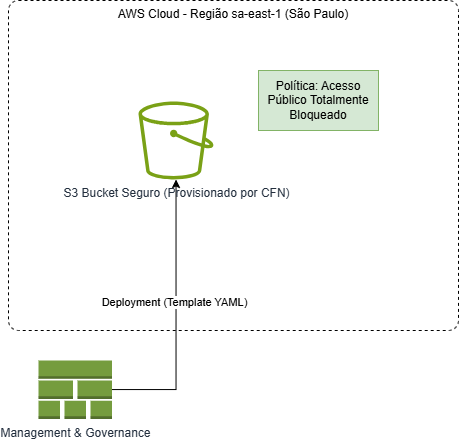

# Desafio DIO: Implementando Infraestrutura Automatizada com AWS CloudFormation

Este repositório documenta minha experiência prática e técnica no desafio da **DIO**, focado em **Infraestrutura como Código (IaC)** e utilizando o serviço nativo da AWS, o **CloudFormation**.

O projeto demonstra a capacidade de modelar, documentar e aplicar boas práticas de segurança em infraestruturas na nuvem.

---

## Objetivos de Aprendizagem

Ao longo desta prática, foquei em consolidar os seguintes conhecimentos e habilidades:

* **IaC Declarativo:** Dominar a sintaxe YAML para definir o estado final da infraestrutura.
* **Boas Práticas de Segurança:** Incorporar regras de segurança (ex: bloqueio de acesso público) diretamente no código de provisionamento.
* **Documentação Profissional:** Utilizar o Draw.io e o Markdown para criar documentação técnica clara e visualmente organizada.
* **Organização de Repositório:** Estruturar o projeto com pastas dedicadas para templates e evidências visuais.

---

## Infraestrutura Modelada: Amazon S3 Bucket Seguro

O recurso escolhido para automatização foi um **Amazon S3 Bucket**, um serviço fundamental de armazenamento na AWS. A principal premissa deste template é que ele deve ser provisionado com **segurança por padrão**.

### 1. Código CloudFormation

O template YAML define o recurso e suas propriedades, garantindo que o acesso público seja totalmente bloqueado, conforme as melhores práticas de segurança (Princípio do Privilégio Mínimo).

**Caminho do Arquivo:** [`templates/s3-bucket-seguro.yaml`][Link para o arquivo templates/s3-bucket-seguro.yaml no seu repositório]

| Seção do Template | Destaque e Função |
| :--- | :--- |
| `AWSTemplateFormatVersion` | Define a versão do template para compatibilidade. |
| `Resources` | Onde o `AWS::S3::Bucket` é definido. |
| `PublicAccessBlockConfiguration` | **Ponto Chave de Segurança.** Define que o bucket não aceita ACLs ou políticas públicas. |
| `Tags` | Utilizado para adicionar metadados como `Environment` e `Project`, essenciais para a organização e gerenciamento de custos na AWS. |
| `Outputs` | Permite que o nome do recurso criado seja facilmente recuperado após a implantação. |

### 2. Diagrama da Arquitetura (Evidência Visual)

O diagrama, criado no Draw.io, representa a arquitetura lógica que o CloudFormation provisionaria na AWS.

**Caminho do Arquivo de Imagem:** [`images/arquitetura-s3-seguro.png`][Link para o arquivo images/arquitetura-s3-seguro.png no seu repositório]

O diagrama mostra:
* A **Região AWS** como o limite do ambiente.
* O serviço **CloudFormation** como o motor de orquestração.
* O **S3 Bucket** como o recurso provisionado, com a segurança de **Acesso Público Bloqueado** como característica intrínseca da sua configuração.

---

## Meus Insights e Principais Aprendizados

A prática deste desafio forneceu insights cruciais sobre a mentalidade IaC na AWS:

* **Segurança por Design:** Aprendi que a segurança deve ser configurada *no código*, e não como uma etapa manual posterior. O `PublicAccessBlockConfiguration` demonstra como o IaC garante que as regras de segurança sejam aplicadas de forma consistente e imutável.
* **Orquestração Declarativa:** A principal diferença em relação a *scripts* é que o CloudFormation cuida da ordem de criação, dependências e do *rollback* automático em caso de falha. Isso remove a complexidade de gerenciar o estado da infraestrutura manualmente.
* **Sintaxe e Flexibilidade:** Compreendi a importância de usar funções intrínsecas (como `!Ref` para referenciar um recurso) para tornar os templates flexíveis e reutilizáveis, evitando valores codificados.
* **O Valor da Visualização:** O uso do Draw.io foi essencial para **validar a arquitetura** logicamente antes mesmo de finalizar o código. Um diagrama claro serve como ponto de partida para a comunicação com outros times.

---

*Desafio proposto por **Digital Innovation One (DIO)**.*
